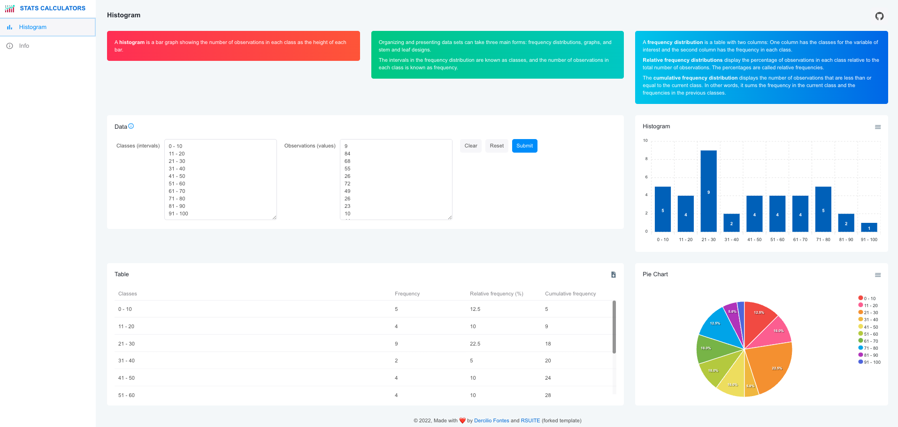

# Stats Calculator

Studying stats and building a web tool to calculate stats, charts and tables.



## Development

Forked from rsuite/rsuite-admin-template

Clone repo and install dependencies

```
npm install
```

Now you can start the development server by running npm run dev

It's serving at http://localhost:3100/ by default.

```
npm run dev
```

## License

MIT
